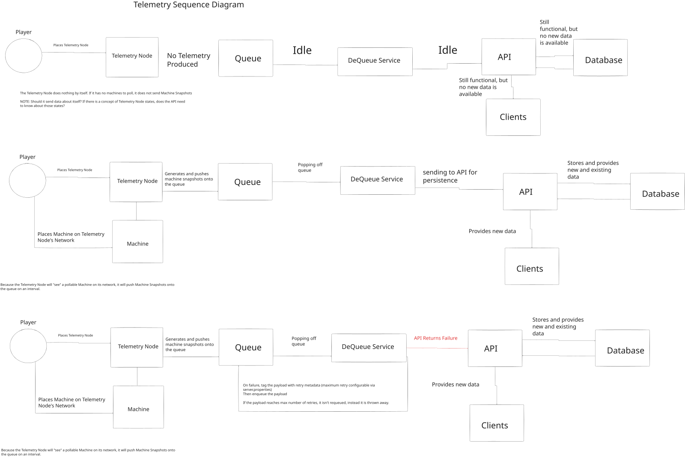

# Overview
Welcome! 🤖 This is a group of applications + a Minecraft Mod I put together with the intent to provide historical data and pseudo-realtime factory insights when using GregTech Machines. There are three different pieces: 

1. Jazzy's Factory Telemetry - The actual Minecraft Mod
2. Jazzy's Factory Telemetry API - A centralized sister application to facilitate moving data
3. Jazzy's Factory Telemetry Dashboard - A visualization client that consumes data from the API.

## Jazzy's Factory Telemetry
Essentially, the mod adds a new block, the Telemetry Node. When networked with GregTech machines, the Telemetry Node will transmit telemetry data to an external service. This service can be configured to grant persistence to the data for factory insights.

## Jazzy's Factory Telemetry API
This is the super nifty service layer that receives data from the Jazzy's Factory Telemetry mod. It is stood up with a database to provide data persistence to all consuming applications.

## Jazzy's Factory Telemetry Dashboard
This is the fun part that you'll actually interact with outside of Minecraft! This application asks the API for data and displays it in a nice pretty fashion.

## Telemetry Flow
A Telemetry Node without linked machines is intentionally idle. Once at least one supported machine is linked, the node periodically generates MachineSnapshots, enqueues them, and they are asynchronously persisted by the API.

When a failure response is returned from the API when pushing telemetry, the Dequeue service will attempt to retry. If it fails after the maximum retry attempts (configurable via server.properties), the failed payload is thrown away.

